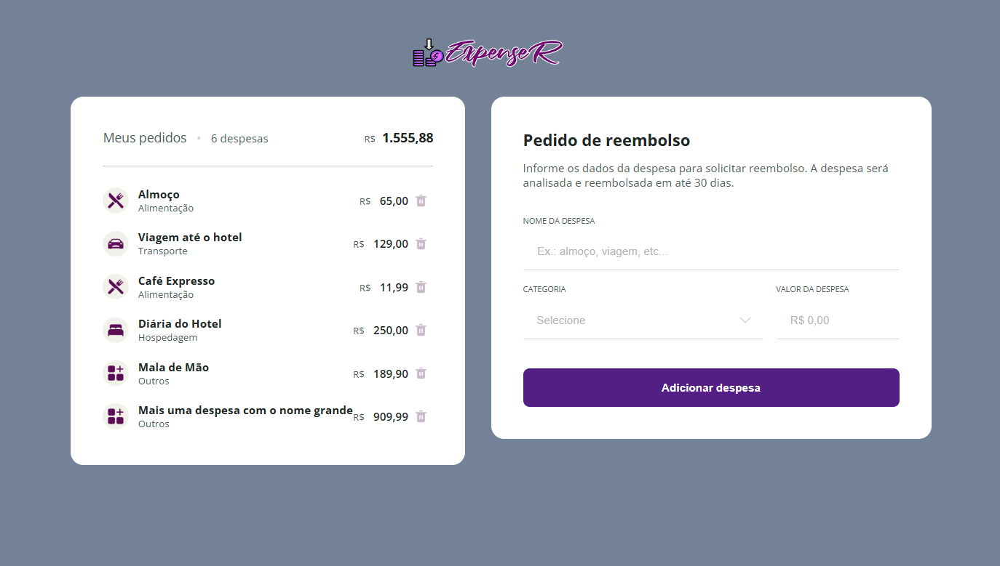

<h1 align="center"> Expenser | Refund 💸</h1>

Um sistema de reembolso de despesas desenvolvido em JavaScript, onde é possível cadastrar gastos, definir categorias e valores, além de visualizar o total acumulado de forma simples e intuitiva.

  <a href="#-tecnologias">Tecnologias</a>&nbsp;&nbsp;&nbsp;|&nbsp;&nbsp;&nbsp;
  <a href="#-projeto">Projeto</a>&nbsp;&nbsp;&nbsp;|&nbsp;&nbsp;&nbsp;
  <a href="#-layout">Layout</a>&nbsp;&nbsp;&nbsp;|&nbsp;&nbsp;&nbsp;
  <a href="#-licença">Licença</a>

  

 

  

## 🤖 Tecnologias

Esse projeto foi desenvolvido com as seguintes tecnologias:

- HTML e CSS
- JavaScript
- Git e Github

## ✨ Funcionalidades

- Adicionar despesas informando nome, categoria e valor.
- Classificação por categorias (alimentação, transporte, hospedagem, outros).
- Cálculo automático do total das despesas cadastradas.
- Remoção de despesas individualmente.
- Visualização organizada de todas as despesas em lista.
- Interface intuitiva e responsiva para facilitar a usabilidade.

## 🛠️ Projeto

O objetivo do projeto é disponibilizar uma ferramenta simples e eficiente para o gerenciamento de despesas, permitindo ao usuário cadastrar, organizar por categorias e acompanhar de forma clara o valor total gasto.

## 👨‍💻 Autor

Projeto desenvolvido por <a href="https://github.com/fabriciobzrr" target="_blank">Fabricio Bezerra</a>.
Se desejar comentar o projeto ou propor colaborações, estou à disposição!

---

Obrigado por visitar — que este projeto inspire criatividade e evolução contínua.
